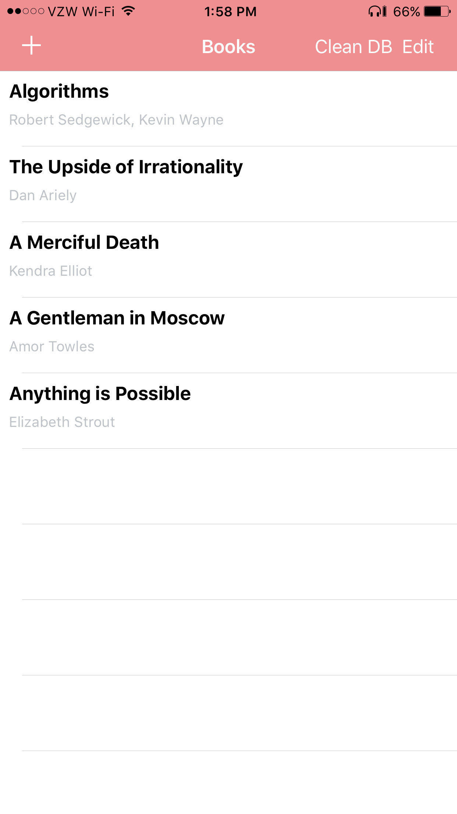
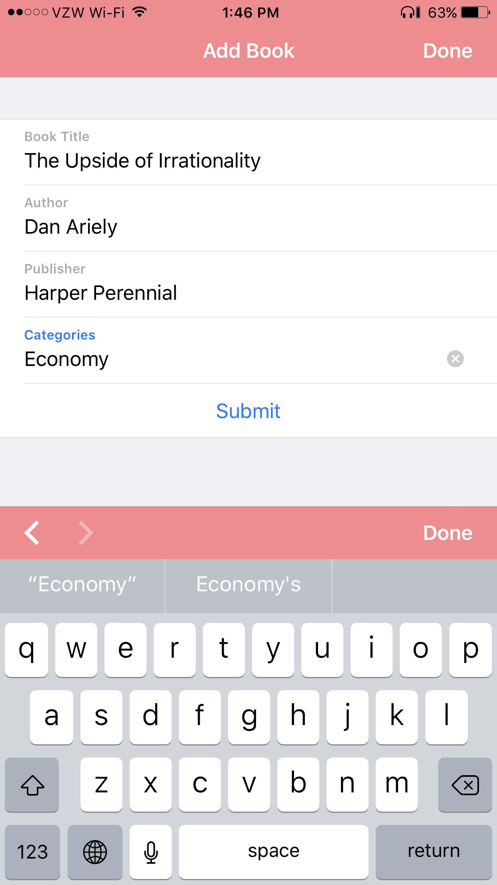
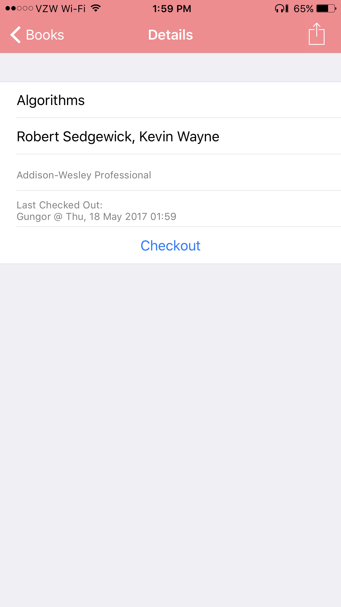
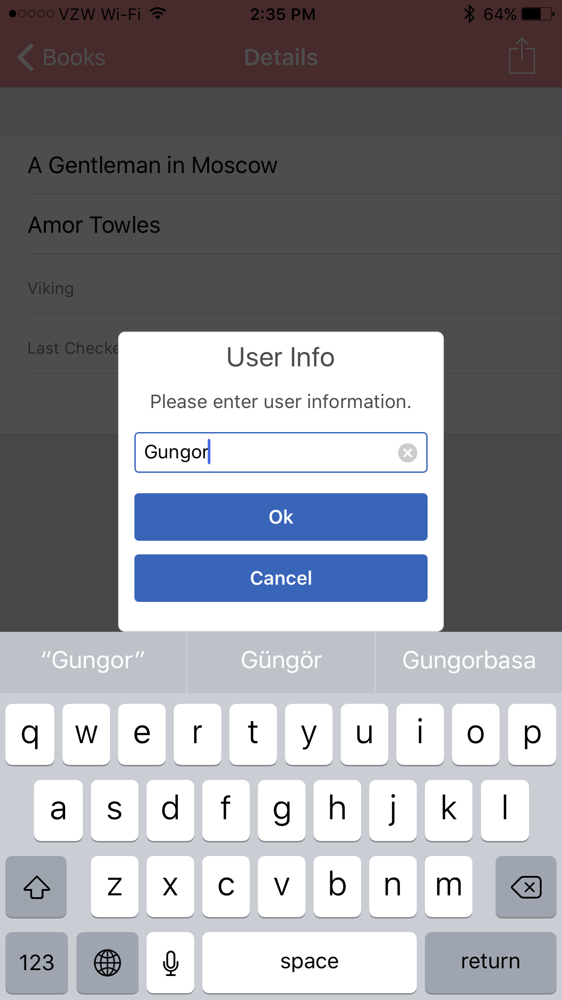
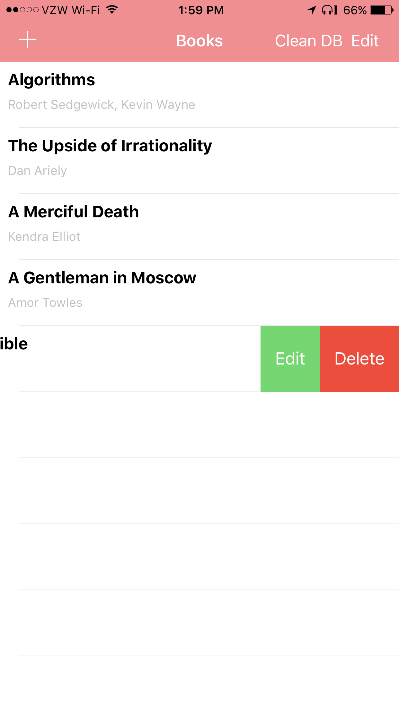
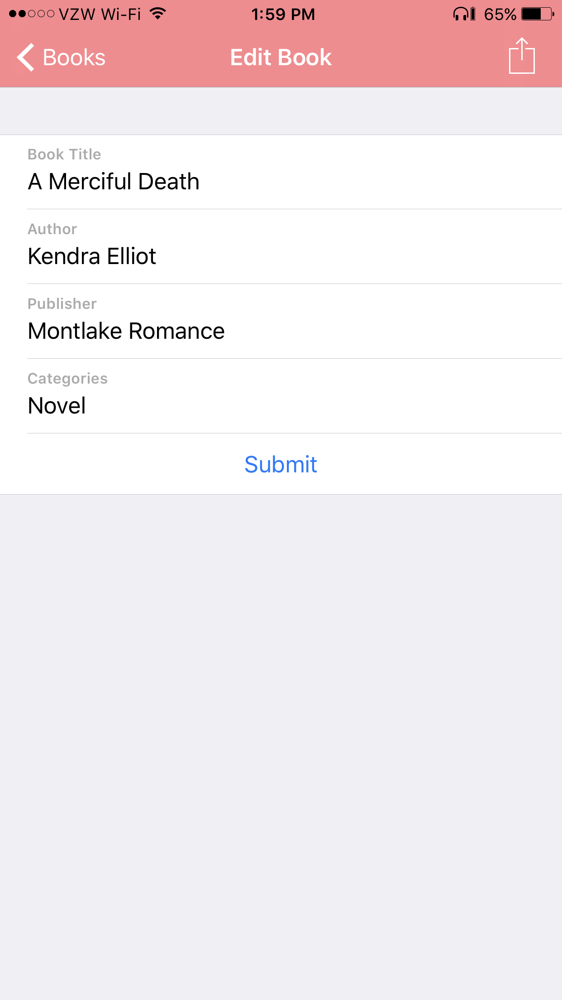
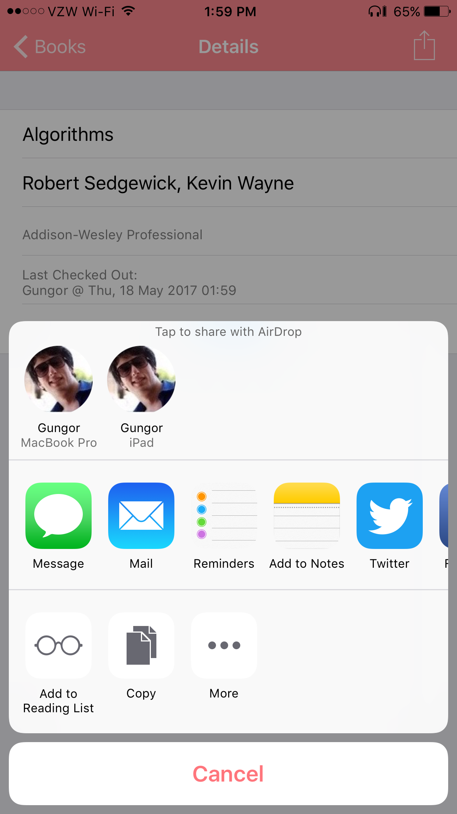

# Prolific Interactive Interview App #

Simple library app. You can add, checkout, edit, and delete books. 

## What is this repository for? ##

* Quick summary: Library app.
* Version: 1.0

## How do I get set up? ##

* Code should work out of the box. All libraries are included to this repository. Just open the `The Prolific Library.xcworkspace` with XCode. In case you encounter a problem, you can use `pod install` command from cocoapods. (More information about [Cocoapods](https://cocoapods.org/))

* Dependencies: 

  `pod 'Alamofire', '~> 4.4'`
  `pod 'AlamofireNetworkActivityIndicator', '~> 2.0'`
  `pod 'AlamofireObjectMapper', '~> 4.0'`
  `pod 'ChameleonFramework/Swift'`
  `pod 'Eureka'`

* How to run tests: Please, use `The Prolific Library Tests/The_Prolific_LibraryTests.swift`

## Screenshots ##

### List Books Screen ###

### Add Book Screen ###

### Book Details Screen ###

### Checkout Book Screen ###

### Swipe to Edit/Delete Screen ###

### Edit Book Screen ###

### Share Book Screen ###

## Side Notes ##
* Everything should work out of the box. If you find any bug, please let me know.
